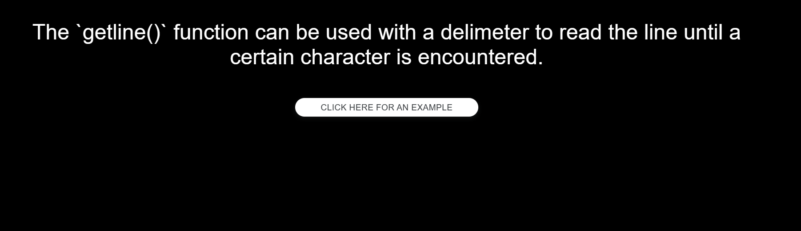
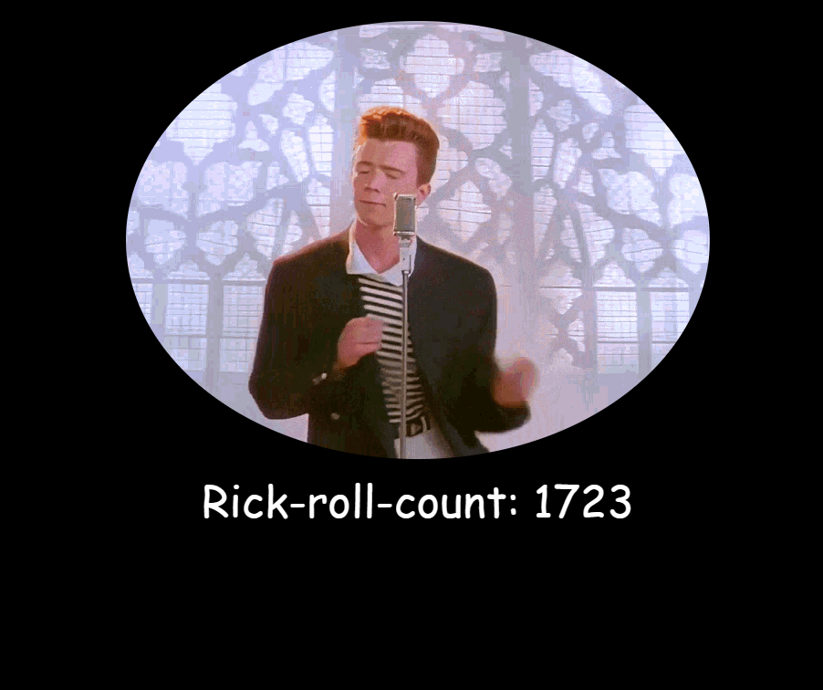

# RickRoll-Counter

A fun mini-project to learn about flask apis and prank cs135 students. Made with the goal to make the project more interesting.

# Demo
Students are greeted with a hint for the project if they are having difficulty with it:

If they click the link for an example, they get rickrolled!:

Here's how it works:

There is also audio to accompany the rickroll gif.
